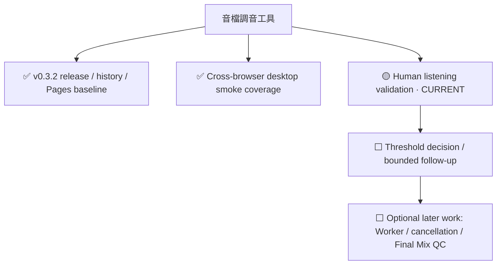

# Project Progress — 音檔調音工具

此頁是 derived coordination view；現況仍以 `TASK_STATE.md`、實際 repository state、測試／CI evidence 與 `docs/worklog.md` 為準。

Last verified: 2026-09-26

## Current state

- Phase: **Post-release validation / maintenance**
- Current milestone progress: **N/A** — repository 尚未定義新的 bounded milestone 與 required denominator
- Current validation gate: **真實音檔人工聆聽**
- Current blocker: 無技術 blocker；threshold 調整刻意等待 human listening evidence
- Next action: 對真實樣本記錄 matched / missed / overreacted
- Exit condition: 聆聽結果已記錄，並對主觀 threshold 是否需要調整做出明確決策

## Compressed progress tree



## Active path

```text
v0.3.2 baseline
└─ Cross-browser automated validation
   └─ Human listening validation  ← CURRENT
      └─ Threshold decision
         └─ only then create a bounded follow-up milestone if needed
```

## Evidence

| Area | State | Evidence |
| --- | --- | --- |
| v0.3.2 baseline | COMPLETE | release/history/privacy/Page state recorded in `TASK_STATE.md` |
| Chromium full E2E | COMPLETE | 4 cases recorded as passing |
| Firefox/WebKit desktop smoke | COMPLETE | 4 smoke cases recorded as passing |
| DSP/report self-tests | COMPLETE | recorded as passing |
| Human listening | ACTIVE / external | explicitly still pending in `TASK_STATE.md` |
| Threshold tuning | DEFERRED | intentionally blocked from change until listening evidence exists |

## Why no percentage

目前沒有正式宣告下一個 bounded milestone，也沒有固定 required-item denominator。為避免把維護型專案偽裝成可計算的 lifetime completion，本頁暫時顯示 `N/A`，直到下一個 milestone 有明確 scope 與 exit criteria。
